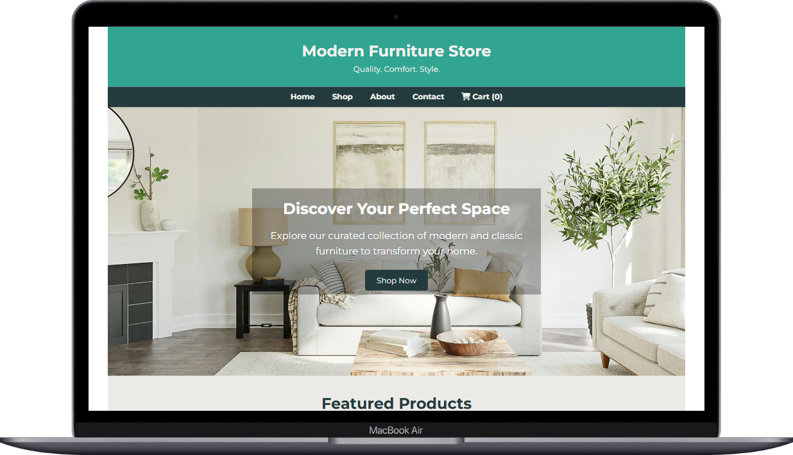
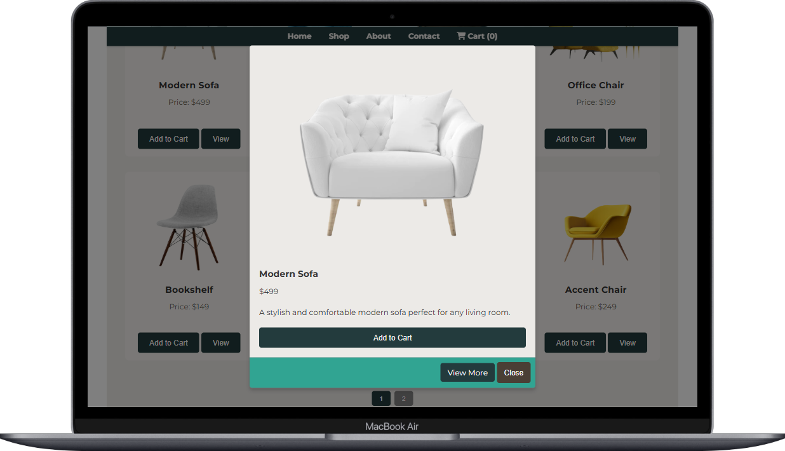
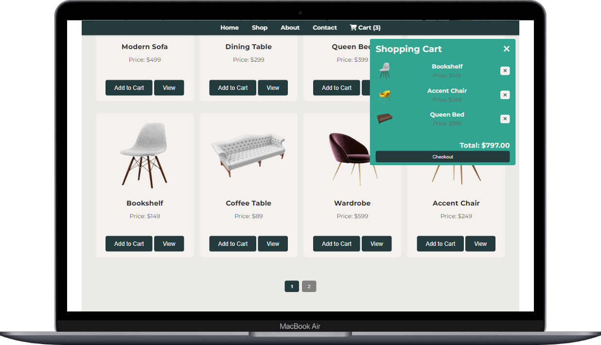

# 🪑 Furniture Store Website

An interactive and responsive eCommerce frontend for a furniture store, built using **HTML, CSS, and JavaScript**. It features product filtering, pagination, modals for product previews, and a dynamic shopping cart with real-time updates and confirmation dialogs.

---

## Live Demo

<a href="https://github.com/paulmagadi/Furniture-Store" style="padding: 11px 20px; background-color: red;
color: white; font-weight: 600; border-radius: 5px;" target="-blank">Live Demo</a>

## 🖼️ Screenshots

  

  



---

## 🚀 Features

✅ **Add to Cart** with quantity tracking  
✅ **Remove from Cart** with modal confirmation  
✅ **Dynamic Cart Total**  
✅ **Filter by Category and Price**  
✅ **Live Product Search**  
✅ **Pagination**  
✅ **Responsive UI**  
🕒 **Cart Persistence with LocalStorage** (Coming soon)

---

## 🧠 How It Works

### 🛒 Cart Logic

```
function updateCartDisplay() {
  // Clears the cart UI
  // Loops through `cart` array and appends item divs
  // Calculates total price
}
```
### ❌ Remove with Confirmation

```
function confirmRemove(id, name) {
  // Shows modal
  // Confirms and removes item from cart
}
```

## 📂 Folder Structure

```
furniture-store/
│
├── index.html
├── styles.css
├── product.css
├── main.js
├──  images/
├── screenshots/
│   └── homepage.png
│   └── product-modal.png
│   └── cart.png
├── README.md
└── LICENCE
```

## 🧪 Sample Code: Add to Cart

```js
function addToCart(productId) {
  const product = products.find(p => p.id === productId);
  cart.push(product);
  updateCartDisplay();
  showAlert(`${product.name} added to cart!`);
}
```

## 📱 Responsive Design
This website adjusts seamlessly to:

✅ Mobile Phones

✅ Tablets

✅ Desktop Screens

It uses flexbox, grid, and media queries for responsiveness.

## 🔧 Tech Stack
- HTML5 – Markup
- CSS3 – Styles & layout
- Vanilla JavaScript – DOM manipulation & logic
- Font Awesome – Icons

## 🔮 Roadmap
- LocalStorage support for cart persistence
- Checkout page & form
- User login mockup
- Backend (Django / Firebase) integration (optional future upgrade)

## 📦 Installation

```
git clone https://github.com/your-username/furniture-store.git
cd furniture-store
```

open index.html

No build tools required — just open in your browser.

## ✍️ Author
Paul Magadi

👨‍💻 Software Developer & UI/UX Enthusiast
[🌐 Portfolio](https://paulmagadi.github.io) | [🐙 GitHub](https://github.com/paulmagadi) | [🔗 LinkedIn](https://www.linkedin.com/in/paulmagadi)

## 📄 License
This project is licensed under the MIT License.


